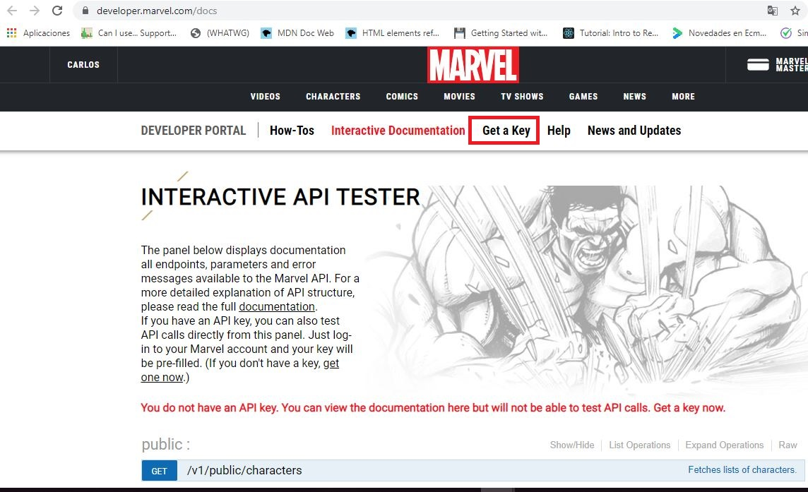
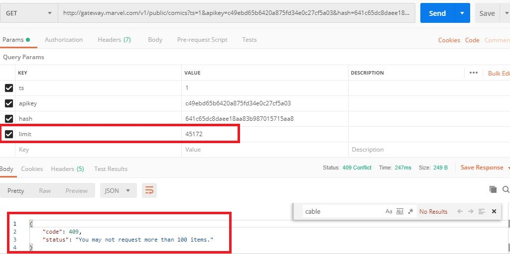

# Challenge C02
RESTful APIs and HTTP requests

-Download postman and get information for a superhero from Marvel API
-Access to https://developer.marvel.com/docs and do all steps to get an API key to get access
-Get information related to the list of characters of Cable & Deadpool (2004) #46 (Zombie Variant)
-Get a list of all stories when Agent X (Nijo) appears
-Generate JSON document with this information and push to GitHub repo

Listed below are the steps taken to retrieve superhero information with the Marvel API.

**Step 1. Get the API key**

After downloading Postman, I signed up in the Marvel developer portal https://developer.marvel.com/docs and did all steps to get an API key to get Access. You need to register and then click on “Get a Key” (as shown in the image below). After that you must follow the indicated steps.



The portal threw me a private key and a public key. 


**Step 2. Generate the hash code**

Once I got the public and private key, i found in the documentation that the API request should have the following form: base URL + timestamp + publickey + hash

Note: I used timestamp=1 in this challenge, but you can use whichever you want.

We have the timestamp('ts' from now on) and public key. Now we need the **hash** code.

In order to obtain the **hash**, I used the website  https://www.md5hashgenerator.com/ 
The **hash** must be generated putting the values in the following order (without spaces): timestamp+private key+public key

The website will throw a string of characters, this string is the hash code.

**Note: please save the hash in a safe place.**


**Step 3. Get information related to the list of characters of Cable & Deadpool (2004) #46 (Zombie Variant)**

Then I opened Postman and started with the following GET query in order to search the comic id of **"Cable & Deadpool (2004) # 46 (Zombie Variant)"**: 

```
http://gateway.marvel.com/v1/public/comics?ts=1&apikey=[your_public_key_here]&hash=[your_hash_here]
```

But I did not succeed with that query because the list only reaches 100 and when you search for the word "Cable" there is no match. This situation can be seen in the following image.


It can be seen in the previous image that the total list of comics is 45172 and the total amount of the query is 20 comics ("count" field).

I tried adding a limit = 45172 parameter to the query but it threw error code 409: "You may not request more than 100 items". This error message can be seen in the following image:



Cause of that I made a different query, this time the query had the following form: 

```
http://gateway.marvel.com/v1/public/characters?ts=1&apikey=[your_public_key_here]&hash=[your_hash_here]
```

Through this second query I could find the comic **"Cable & Deadpool (2004) # 46 (Zombie Variant)"** with its corresponding id, as seen in the following image:


With the ID 21845 I got information related to the list of characters of Cable & Deadpool (2004) #46 (Zombie Variant). The query was the following:

```
http://gateway.marvel.com/v1/public/comics/21845?ts=1&apikey=[your_public_key_here]&hash=[your_hash_here]
```
The results are shown in the image below:


Finally, with the information contained in the "data" field I generated a **JSON document** named **“cableAndDeadpoolCharacters.json”**. This document is in the same folder (Challenge-C02)  of this README file.

**Step 4. Get a list of all stories when Agent X (Nijo) appears**

In the same previous query you can find the ID of the character Agent X (Nijo), which is 1011031. As can be seen in the following image:


With the ID it is already possible to obtain the stories where Agent X (Nijo) appears, the query used is:

```
http://gateway.marvel.com/v1/public/characters/1011031/stories?ts=1&apikey=[your_public_key_here]&hash=[your_hash_here]
```

The results of the previous query are shown in the following image: 


As you can see in the previous image, the total results are 23 characters but only 20 are displayed. For this reason it is necessary to add the limit = 23 parameter and make the query again. The complete query is as follows:

```
http://gateway.marvel.com/v1/public/characters/1011031/stories?ts=1&apikey=[your_public_key_here]&hash=[your_hash_here]&limit=23
```

The results now show the complete list of characters, as seen in the following image:


Finally, with the information contained in the “data” field, i generated a JSON document named **agentX(Nijo)Stories.json**. This This document is in the same folder (Challenge-C02)  of this Readme file.  