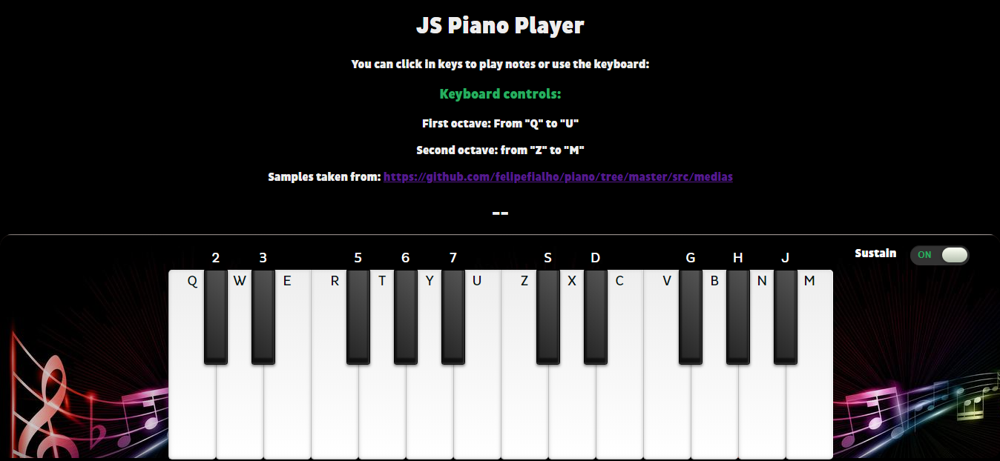
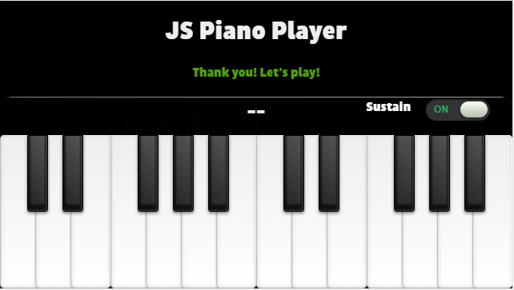
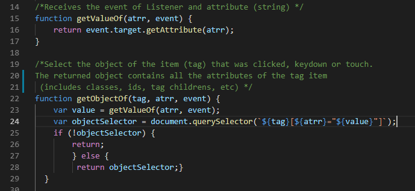
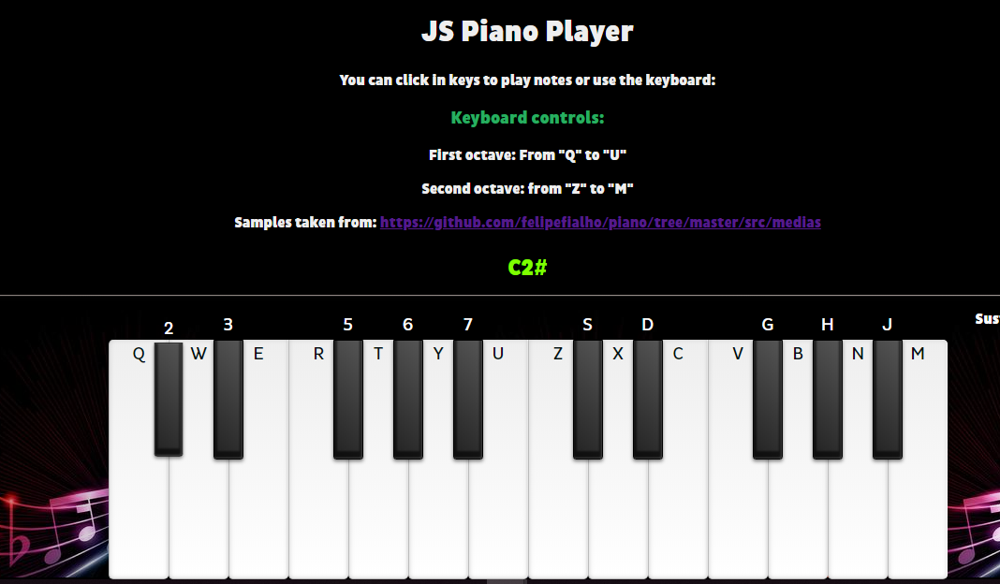
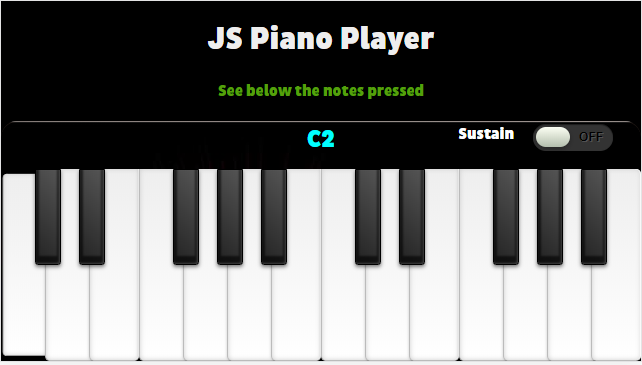
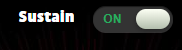

# Challenge C04
- Create a piano player

- Use event listener for add sounds of notes in a piano design 

- Build all design with CSS and HTML
- Add listeners for launch all sounds, found the sound    resources in the notes folder (Download here)
- Enable click or keyboard events for proper user experience
- Push all the example in your GitHub repo

Find below the organization of this Challenge. Here we go!

## Piano Design

With the aim of designing the piano, this project was divided into three parts: structure (HTML), style (CSS) and interactivity (JavaScript).

## HTML

First the piano was performed in the form of a list, where each "<li>" label corresponds to a piano key. This piano is made up of two octaves, that is, two sections of twelve keys, seven white and five black in each octave. The sections were duly separated at the code level, which facilitates their readability.

Then the references to the audio files in the index.html file were preloaded.

Finally, a header was added containing the instructions to play the piano on a computer. A checkbox was also added to enable or disable "Sustained" mode.

## CSS

In this part of the project styles were added to each key so that the illusion of when a key is pressed is seen.

Three media queries were also added to the style.css file exclusively for Responsive design and the "Mobile First" approach.

Below you can see two screenshots of what the interface looks like in Desktop and Mobile:

**Desktop View:** 

**Mobile View:**

## JavaScript

For me this was the best part of the Challenge, I really enjoyed it. At first I started a little messy with the code but then everything was taking shape.

I divided this part into two files: functions.js and listeners.js.

**functions.js**

Basically here are the functions used by the listeners to be able to carry out the tasks of reproducing the sounds with the mouse, keyboard and touch events.

What I found most interesting is that as I reviewed the code I found new ways to optimize it. I even think I did some functional programming, specifically in this code section of the file in question:

**Code snippet of two functions from functions.js:**

**listeners.js**

In this file I have nine listeners: 

- Two for play the audios with mouse (mousedown and mouseup)
- Two for play the audios with keyboard (keydown and keyup)
- Two for play the audios with touch in mobile devices (touchstart and touchend)
- Three for show the musical note of the key pressed (mousedown, keydown and touchstart)

## **Bonus Track**

 ### **1. Listeners for touch events in mobile devices**

 Touch events for mobile devices in order to make this project "Mobile First"

 ### **2. Listeners for show the musical note when a key is pressed** 

 In the following image you can see what i'm talking about 

**Desktop:**

**Mobile:**

 **Note:** This piano have the C2 and C3 octaves

 ### **3. Sustain Mode**

 Sustain mode checkbox visible in Desktop and mobile devices. You can see it in the image below: 

**References:** 

- The samples were extracted from: https://github.com/felipefialho/piano/tree/master/src/medias

- The checkbox (sustain mode) style was extracted from: https://codepen.io/bbodine1/pen/novBm 

